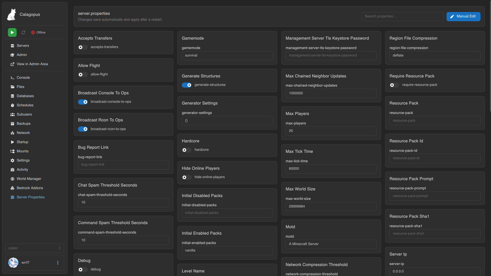

# Server Properties

A simple GUI editor for a Minecraft server's `server.properties`. Toggles for true/false, text fields for everything else, and it **auto-saves** as you change things.

GitHub: https://github.com/wrrfsub/Server-Properties-Editor-For-Calagopus

**Download:** [click here to download](https://github.com/wrrfsub/Server-Properties-Editor-For-Calagopus/raw/main/file/com_subwaystudios_serverproperties.c7s.zip)

## Setup

1. Upload `com_subwaystudios_serverproperties.c7s.zip` in **Admin → Extensions** and hit **Rebuild Extensions**.
2. (Optional) Open the extension settings and pick which **eggs** show the editor. Leave empty to show it on every server.

A **Server Properties** page then appears in each server's sidebar.

> [!TIP]
> Use **Manual Edit** (top right) to open the raw `server.properties` in the file editor for anything the GUI doesn't cover.

> [!IMPORTANT]
> Changes only take effect after a server **restart**.

---

